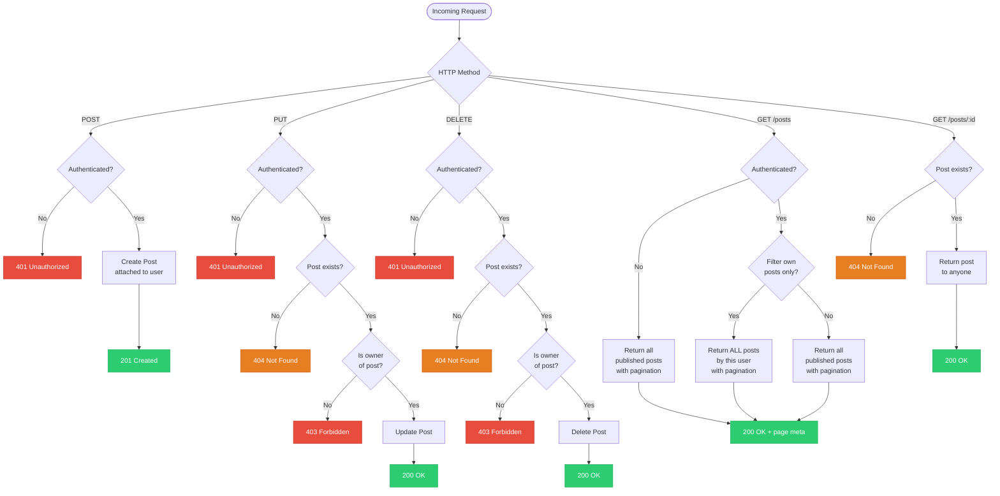
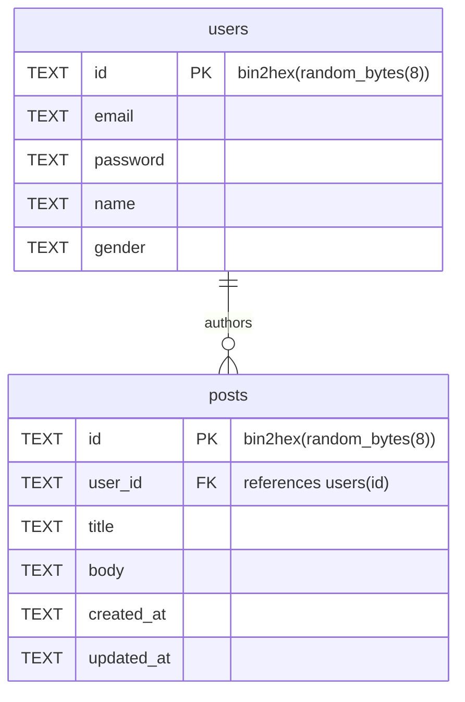

# Post Feature Flow



## Summary

| Operation | Who can do it |
|---|---|
| Create Post | Authenticated users only |
| Update Post | Authenticated owner of the post only |
| Delete Post | Authenticated owner of the post only |
| View multiple posts (paginated) | Anyone; authenticated users can filter to see ALL their own posts |
| View single post | Anyone |

---

## Database Schema

### Entity Relationship



### SQL

```sql
-- Existing table (reference)
CREATE TABLE IF NOT EXISTS users (
  id       TEXT PRIMARY KEY,
  email    TEXT,
  password TEXT,
  name     TEXT,
  gender   TEXT
);

-- New table
CREATE TABLE IF NOT EXISTS posts (
  id         TEXT PRIMARY KEY,
  user_id    TEXT NOT NULL,
  title      TEXT NOT NULL,
  body       TEXT NOT NULL,
  created_at TEXT NOT NULL DEFAULT (datetime('now')),
  updated_at TEXT NOT NULL DEFAULT (datetime('now')),
  FOREIGN KEY (user_id) REFERENCES users(id) ON DELETE CASCADE
);
```

### Field Notes

| Field | Type | Notes |
|---|---|---|
| `id` | TEXT | Random hex — `bin2hex(random_bytes(8))`, same pattern as `users.id` |
| `user_id` | TEXT | FK to `users.id`; cascades delete so posts are removed when the user is deleted |
| `title` | TEXT | Required short title of the post |
| `body` | TEXT | Required full content of the post |
| `created_at` | TEXT | ISO-8601 UTC timestamp; set once on insert |
| `updated_at` | TEXT | ISO-8601 UTC timestamp; updated on every edit |